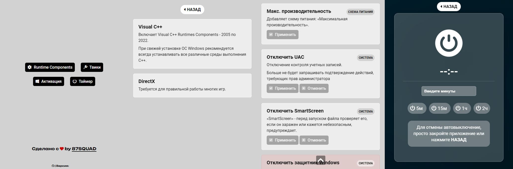

# WAAS
 Windows Assistant

* * *

**Windows Assistant** - это софт созданый в первую очередь для использования после свежей установки Windows.

Установка всех *Runtime Components*, которые так нужны для работы многих программ и игр. Базовые твики - они будут пополнятся. А так же таймер автовыключения ПК, просто почему бы и нет.

* *Часть функционала будет работать на Windows 7\8.1*
* *Большинство функционала будет работать на Windows 10\11*
* *100% функционала будет работать на Windows 10*